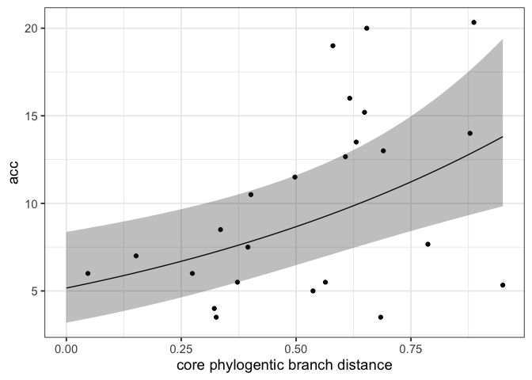
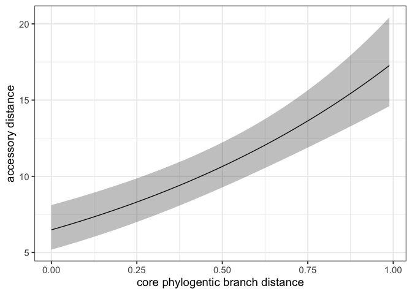
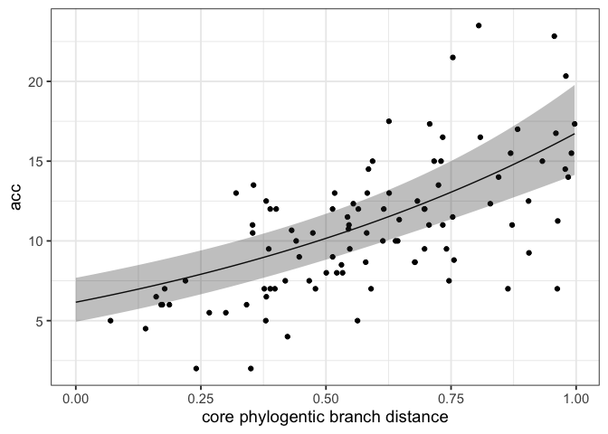
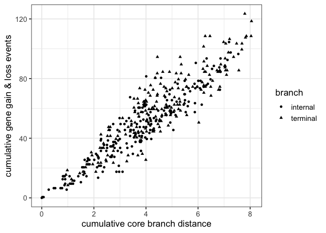
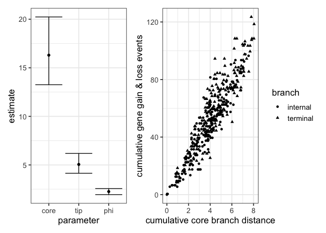
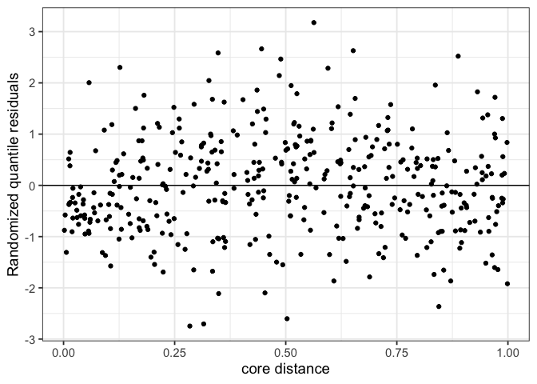
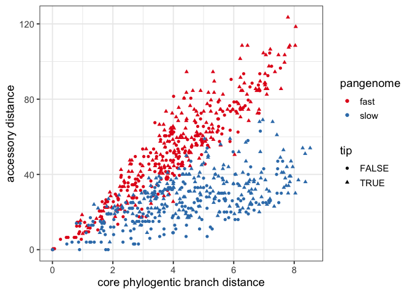
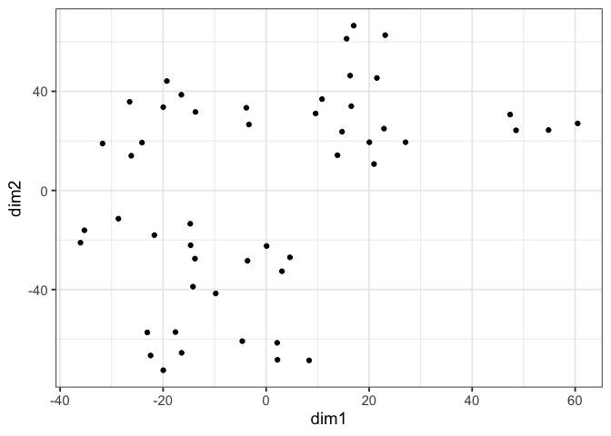

panstripe
================

<!-- badges: start -->
[](https://github.com/gtonkinhill/panstripe/actions)
<!-- [](https://zenodo.org/badge/latestdoi/137083307) -->
<!-- badges: end -->


<p align="center">

</p>

Panstripe improves the post processing of bacterial pangenome analyses.
In particular it aims to replace the dubious but popular pangenome
accumulation curve. The package is currently under development so
frequent changes are to be expected.

-   [Installation](#installation)
-   [Quick Start](#quick-start)
-   [Citation](#citation)
-   [Comparing Pangenomes](#comparing-pangenomes)
-   [Open vs Closed](#open-vs-closed)
-   [Rate vs Size](#rate-vs-size)
-   [Output](#output)
-   [Plots](#plots)
    -   [Pangenome fit](#pangenome-fit)
    -   [Tree with presence/absence](#tree-with-presenceabsence)
    -   [Inferred ancestral states](#inferred-ancestral-states)
    -   [tSNE](#tsne)
    -   [Accumulation curves](#accumulation-curves)
    -   [Etymology](#etymology)

<!-- README.md is generated from README.Rmd. Please edit that file -->

## Installation

`panstripe` is currently available on GitHub. It can be installed with
`devtools`

``` r
install.packages("remotes")
remotes::install_github("gtonkinhill/panstripe")
```

If you would like to also build the vignette with your installation run:

``` r
remotes::install_github("gtonkinhill/panstripe", build_vignettes = TRUE)
```

## Quick Start

Panstripe takes as input a phylogeny and gene presence/absence matrix in
Rtab format as is produced by
[Panaroo](https://gtonkinhill.github.io/panaroo/#/),
[Roary](https://github.com/sanger-pathogens/Roary),
[PIRATE](https://github.com/SionBayliss/PIRATE) and other prokaryotic
pangenome tools.

``` r
library(panstripe)
library(ape)
set.seed(1234)

### NOTE: here we load example files from the panstripe package. You should replace
### these variables with the relevant paths to the files you are using.
phylo.file.name <- system.file("extdata", "tree.newick", package = "panstripe")
rtab.file.name <- system.file("extdata", "gene_presence_absence.Rtab", package = "panstripe")
### 

# Load files
pa <- read_rtab(rtab.file.name)
tree <- read.tree(phylo.file.name)

# Run panstripe
fit <- panstripe(pa, tree)
fit$summary
#> # A tibble: 7 × 7
#>   term   estimate std.error statistic  p.value `bootstrap CI …` `bootstrap CI …`
#>   <chr>     <dbl>     <dbl>     <dbl>    <dbl>            <dbl>            <dbl>
#> 1 Inter…  0.949      0.247     3.85    2.16e-4            0.476            1.43 
#> 2 istip   0.708      0.313     2.27    2.58e-2            0.109            1.28 
#> 3 core    1.82       0.363     5.01    2.63e-6            1.01             2.56 
#> 4 depth  -0.00302    0.0569   -0.0531  9.58e-1           -0.118            0.124
#> 5 istip… -0.784      0.474    -1.65    1.01e-1           -1.76             0.264
#> 6 p       1.19      NA        NA      NA                  1.12             1.35 
#> 7 phi     2.20      NA        NA      NA                  1.82             3.15

# Plot results
plot_pangenome_fits(fit, type = "cumulative", include_data = TRUE)
```

<!-- -->

A significant p-value for the `tip` term indicates that there is a
different rate of gene exchange at the tips of the phylogeny compared
with the internal branches. This is usually driven by annotation errors
or highly mobile elements that do not persist long enough to be observed
in multiple genomes.

A significant p-value for the `core` term indicates that there is a
significant association between the core genome branch length and the
number of gene exchange events.

The `depth` term is less interesting but indicates when there is a
difference in our ability to detect older gene exchange events.

## Citation

To cite panstripe please use:

## Comparing Pangenomes

As `panstripe` uses a GLM framework it is straightforward to compare the
slope terms between datasets. The `compare_pangenomes` function
considers the interaction term between the data sets and the `core`,
`tip` and `depth` terms.

> **IMPORTANT:** *It is important that the phylogenies for the
> pangenomes being compared are on the same scale. This can be achieved
> most easily by using time scaled phylogenies. Alternatively, it is
> possible to build a single phylogeny and partition it into clades or
> use SNP scaled phylogenies.*

Here, we simulate two pangenomes with different gene exhange rates, fit
the model using `panstripe` and run the `compare_pangenomes` function.

``` r
# Simulate a fast gene gain/loss rate with error
sim_fast <- simulate_pan(rate = 0.001, ngenomes = 200)
sim_slow <- simulate_pan(rate = 5e-04, ngenomes = 200)

# Run panstripe
fit_fast <- panstripe(sim_fast$pa, sim_fast$tree)
fit_slow <- panstripe(sim_slow$pa, sim_slow$tree)

# Compare the fits
result <- compare_pangenomes(fit_fast, fit_slow)
result$summary
#> # A tibble: 4 × 7
#>   term    estimate std.error statistic p.value `bootstrap CI …` `bootstrap CI …`
#>   <chr>      <dbl>     <dbl>     <dbl>   <dbl>            <dbl>            <dbl>
#> 1 depth    -0.0573    0.0259    -2.22  2.68e-2          -0.0974          -0.0107
#> 2 istip    -0.0510    0.167     -0.305 7.61e-1          -0.345            0.188 
#> 3 core     -0.693     0.161     -4.30  1.91e-5          -1.01            -0.391 
#> 4 disper…  NA        NA          0.387 5.34e-1          NA               NA
```

A significant p-value for the `tip` term indicates that the two
pangenomes differ in the rates of gene presence and absence assigned to
the tips of the phylogeny. This is usually driven by either differences
in the annotation error rates between data sets or differences in the
gain and loss of highly mobile elements that do not persist long enough
to be observed in multiple genomes.

A significant p-value for the `core` term indicates that two data sets
have different rates of gene gain and loss.

The `depth` term is less interesting but indicates when there is a
difference in our ability to detect older gene exchange events between
the two pangenomes.

The `dispersion` parameter indicates if there is a significant
difference in the dispersion of the two pangenomes. This suggests that
the relationship between the rate of gene exchange and the size of each
event differs in the two pangenomes. Here, the p-value is obtained using
a Likelihood Ratio Test.

## Open vs Closed

The definition of what constitutes an open or closed pangenome is
somewhat ambiguous. We prefer to consider whether there is evidence for
a temporal signal in the pattern of gene gain and loss. This prevents
annotation errors leading to misleading results.

After fitting a `panstripe` model the significance of the temporal
signal can be assessed by considering the coefficient and p-value of the
‘core’ term in the model. The uncertainty of this estimate can also be
investigated by looking at the bootstrap confidence intervals of the
core term.

Let’s simulate a ‘closed’ pangenome

``` r
sim_closed <- simulate_pan(rate = 0, ngenomes = 100)
fit_closed <- panstripe(sim_closed$pa, sim_closed$tree)

fit_closed$summary
#> # A tibble: 7 × 7
#>   term    estimate std.error statistic p.value `bootstrap CI …` `bootstrap CI …`
#>   <chr>      <dbl>     <dbl>     <dbl>   <dbl>            <dbl>            <dbl>
#> 1 Interc… -21.2    1817.      -1.16e-2   0.991          -24.1           -17.8   
#> 2 istip    22.7    1817.       1.25e-2   0.990           19.4            25.6   
#> 3 core     -0.0315 3178.      -9.91e-6   1.00            -0.117           0.0525
#> 4 depth    -0.0452    0.0375  -1.20e+0   0.230           -0.149           0.0563
#> 5 istip:…   0.102  3178.       3.23e-5   1.00            -0.172           0.373 
#> 6 p         1.05     NA       NA        NA                1.00            1.66  
#> 7 phi       0.401    NA       NA        NA                0.262           1.31
```

The p-value indicates that there is not a significant association
between core branch lengths and gene gain/loss. This is typical of
species that undergo very little to no recombination such as *M.
tuberculosis*.

## Rate vs Size

While comparing the `core` parameter of the model identifies differences
in the association between branch lengths and gene gain and loss it does
not indicate whether this is driven by higher rates of recombination or
simply larger recombination events involving more genes.

The `panstripe` model allows these two scenarios to be investigated by
allowing the dispersion parameter in the model to be different for each
pangenome.

Here, we simulate two data sets with the same recombination rate but
where each recombination event differs in the number of genes involved.

``` r
sim_large <- simulate_pan(rate = 0.001, ngenomes = 100, mean_trans_size = 3)
sim_small <- simulate_pan(rate = 0.001, ngenomes = 100, mean_trans_size = 4)

fit_large <- panstripe(sim_large$pa, sim_large$tree)
fit_small <- panstripe(sim_small$pa, sim_small$tree)

# Compare the fits
result <- compare_pangenomes(fit_fast, fit_slow)
result$summary
#> # A tibble: 4 × 7
#>   term    estimate std.error statistic p.value `bootstrap CI …` `bootstrap CI …`
#>   <chr>      <dbl>     <dbl>     <dbl>   <dbl>            <dbl>            <dbl>
#> 1 depth    -0.0573    0.0259    -2.22  2.68e-2           -0.101         -0.00792
#> 2 istip    -0.0510    0.167     -0.305 7.61e-1           -0.307          0.178  
#> 3 core     -0.693     0.161     -4.30  1.91e-5           -1.02          -0.372  
#> 4 disper…  NA        NA          0.387 5.34e-1           NA             NA
```

## Output

The `panstripe` function generates a list with the following attributes

#### summary

A table indicating a subset of the inferred parameters of the GLM. The
p-values and bootstrap confidence intervals can be used to determine
whether each term in the model is significantly associated with gene
gain and loss.

-   **core** indicates whether the branch lengths in the phylogeny are
    associated with gene gain and loss.

-   **tip** indicates associations with genes observed to occur on the
    tips of the phylogeny. These are usually driven by a combination of
    annotation errors and depending upon the temporal sampling density
    also highly mobile elements that are not observed in multiple
    genomes.

-   **depth** indicates whether the rate of gene gain and loss changes
    significantly with the depth of a branch. Typically, our ability to
    detect gene exchange events reduces for older ancestral branches.

-   **p** the inferred index parameter of the underlying Tweedie
    distribution used in the GLM

-   **phi** the inferred dispersion parameter of the GLM

#### model

The output of fitting the GLM model. This object can be used to predict
how many gene gains and losses we would expect to observe given the
parameters of a particular branch.

#### data

A table with the data used to fit the model. The `acc` column indicates
the inferred number of gene gain/loss events for a branch; the `core`
column is the branch length taken from the phylogeny; the `istip` column
indicates whether the branch occurs at the tip of the phylogeny and the
`depth` column indicates the distance from the root node to the branch.

#### ci\_samples

A ‘boot’ object, generated by the
[boot](https://cran.r-project.org/web/packages/boot/boot.pdf) package.
Can be used to investigate the uncertainty in the parameter estimates.

#### tree/pa

The original data provided to the `panstripe` function.

## Plots

Panstripe includes a number of useful plotting functions to help with
interpretation of the output of
[panaroo](https://gtonkinhill.github.io/panaroo/#/).

### Pangenome fit

A simple plot of the fit of the model along with the input data points
can be made by running

``` r
plot_pangenome_fits(fit_fast)
```

<!-- -->

By default this will plot each branch separately. It is also possible to
generate a cumulative version representing the total gene gain and loss
events from the route of the phylogeny.

``` r
plot_pangenome_fits(fit_fast, type = "cumulative")
```

<!-- -->

It is also possible to plot the data points along with the model fit

``` r
plot_pangenome_fits(fit_fast, type = "cumulative", include_data = TRUE)
```

<!-- -->

The function can also take a named list as input allowing for easy
comparisons between data sets

``` r
plot_pangenome_fits(list(fast = fit_fast, slow = fit_slow))
```

<!-- -->

### Tree with presence/absence

A plot of the phylogeny and the corresponding gene presence/absence
matrix can be made using the `plot_tree_pa` function. This function also
takes an optional vector of gene names to include in the plot.

``` r
# look at only those genes that vary
variable_genes <- colnames(pa)[apply(pa, 2, sd) > 0]

plot_tree_pa(tree = tree, pa = pa, genes = variable_genes, label_genes = FALSE, cols = "black")
```

<!-- -->

### Inferred ancestral states

The `plot_gain_loss` function allows for the visualisation of the fitted
gene gain and loss events on the given phylogeny. The enrichment for
events at the tips of a tree is often driven by a combination of highly
mobile elements and annotation errors.

``` r
plot_gain_loss(fit)
```

<!-- -->

### tSNE

The tSNE dimension reduction technique can be used to investigate
evidence for clusters within the pangenome.

``` r
plot_tsne(pa)
```

<!-- -->

The [Mandrake](https://github.com/johnlees/mandrake) method can also be
used as an alternative to tSNE.

### Accumulation curves

While we do not recommend the use of accumulation curves as they do not
account for population structure, sampling bias or annotation errors we
have included a function to plot them to make it easier for users to
compare methods.

``` r
plot_acc(list(fast = sim_fast$pa, slow = sim_slow$pa))
```

<!-- -->

### Etymology

The name panstripe is an adaptation of ‘pinstripe’, the name of a
[long-nosed potoroo](https://en.wikipedia.org/wiki/Long-nosed_potoroo)
who was a villain in the playstation game [Crash
Bandicoot](https://crashbandicoot.fandom.com/wiki/Pinstripe_Potoroo).
The name was chosen as the program relies on the output of panaroo
(named after the potoroo).
